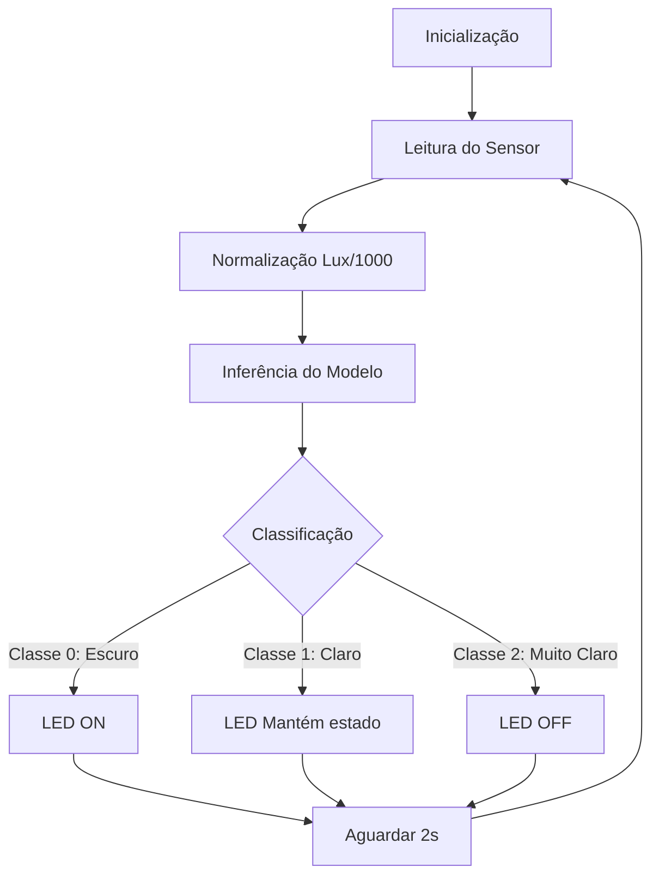

# Hello World ML - Implementação de TinyML no ESP32


Implementação prática de um sistema de controle de iluminação inteligente utilizando TinyML no ESP32. Este projeto demonstra o ciclo completo desde a leitura do sensor até a inferência do modelo e atuação.

## 📋 Visão Geral

Este projeto é a continuação prática do [LuxIA](https://github.com/antoniojosemota/LuxIA), onde o modelo treinado é implementado em hardware real. O sistema utiliza um sensor de luminosidade BH1750 e um LED para demonstrar o controle automático baseado em aprendizado de máquina.

## 🛠️ Hardware Necessário

| Componente | Especificação | Conexão |
|------------|--------------|---------|
| Microcontrolador | ESP32 (qualquer modelo) | - |
| Sensor de Luz | BH1750 (I2C) | SDA -> GPIO 21<br>SCL -> GPIO 22 |
| Atuador | LED com resistor 220Ω | GPIO 15 |

### Diagrama de Conexões
🔌 Ligações ESP32 + BH1750 + LED
### 📡 Sensor de Luminosidade BH1750

| ESP32    | BH1750 |
|----------|--------|
| GPIO 21  | SDA    |
| GPIO 22  | SCL    |
| 3.3V     | VCC    |
| GND      | GND    |

---

### 💡 LED

| ESP32   | Componente |
|---------|------------|
| GPIO 15 | Resistor 220Ω |
| Resistor 220Ω | Ânodo (+) do LED |
| Cátodo (-) do LED | GND |

---

### 📝 Observações
- O BH1750 utiliza comunicação **I2C**.
- Certifique-se de que o resistor do LED seja aproximadamente **220Ω** para evitar sobrecorrente.
- O ESP32 opera em **3.3V**, então não utilize 5V no sensor.


## 💻 Configuração do Ambiente

### Pré-requisitos

- [PlatformIO IDE](https://platformio.org/install) (extensão VSCode)
- Git

### Instalação

1. **Clone o repositório:**
```bash
git clone https://github.com/antoniojosemota/Hello-World-ML.git
cd Hello-World-ML
```

2. Abra no PlatformIO:

    - VSCode → Arquivo → Abrir Pasta → Selecione Hello-World-ML

    - Aguarde o PlatformIO configurar automaticamente o projeto

3. Instale as dependências:
O PlatformIO instalará automaticamente as bibliotecas listadas no platformio.ini:

    - EloquentTinyML

    - BH1750

## 📁 Estrutura do Projeto
```text
Hello-World-ML/
├── platformio.ini          # Configuração do projeto PlatformIO
├── src/
│   ├── main.cpp            # Código principal do firmware
│   └── luxia.h             # Modelo TinyML em formato C array
└── README.md               # Este arquivo
```
## 🧠 O Modelo de Machine Learning
O modelo embarcado (luxia.h) é uma rede neural convertida para TensorFlow Lite e otimizada para execução no ESP32.

### Características do Modelo
- Formato: TensorFlow Lite quantizado (INT8)

- Entrada: 1 valor (luminosidade normalizada)

- Saída: 3 classes de probabilidade

- Tensor: 8KB de RAM alocados

- Tamanho: ~1KB no flash

# 🔄 Fluxograma do Sistema hELLO WORLD ML (ESP32 + TinyML)



## 🧠 Descrição do Fluxo

1. Inicialização → Configuração do sensor BH1750 e do modelo TinyML.

2. Leitura do Sensor → Captura do valor de luminosidade em lux.

3. Normalização → Valor convertido para lux/1000.

4. Inferência → Modelo TensorFlow Lite realiza a predição.

5. Classificação →

    - Classe 0 → Ambiente escuro → LED ligado

    - Classe 1 → Ambiente claro → LED mantém estado

    - Classe 2 → Ambiente muito claro → LED desligado

6. Delay de 1 segundo → Evita leituras excessivas.

7. O ciclo reinicia.

## 📊 Monitoramento Serial
O sistema envia informações detalhadas pela porta serial para depuração:
```text
Luminosidade: 45.20 Lux
Saída do modelo: [0.92, 0.06, 0.02]
Classe predita: 0 (ESCURO)
Ação: LED LIGADO
-------------------
Luminosidade: 312.80 Lux
Saída do modelo: [0.03, 0.88, 0.09]
Classe predita: 1 (CLARO)
Ação: Manter estado atual
-------------------
```
## 🔧 Compilação e Upload
Via PlatformIO
- Compilar o projeto:
```bash
pio run
```
- Fazer upload para o ESP32:
```bash
pio run --target upload
```
- Monitor serial:
```bash
pio device monitor
```
- Configuração da Porta Serial
```
platformio.ini
monitor_speed = 115200
monitor_filters = default
```
## 🎯 Testes e Validação
- Cenários de Teste:

1. Ambiente escuro (< 100 Lux)

    - Cobrir o sensor com a mão

    - LED deve acender

2. Luz ambiente (100-500 Lux)

    - Ambiente normalmente iluminado

    - LED mantém estado anterior

3. Luz forte (> 500 Lux)

    - Aproximar lanterna do sensor

    - LED deve apagar


## 📄 Licença
Este projeto está sob a licença MIT. Veja o arquivo LICENSE para mais detalhes.

### ✨ Autor
António José Mota - GitHub
